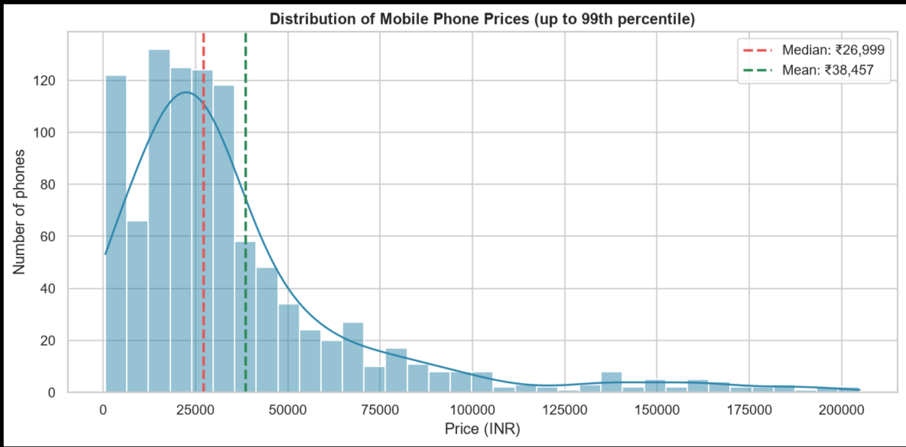
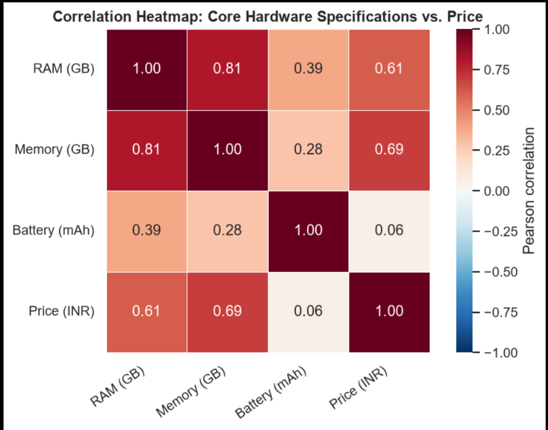
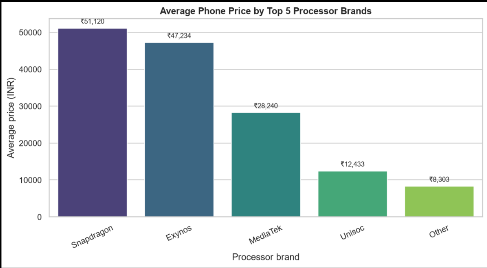
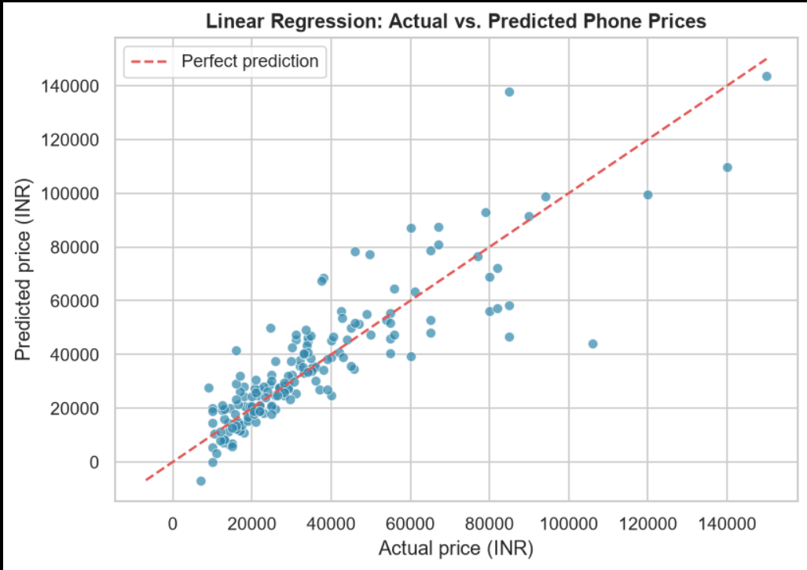

# 📱 Mobile Phone Market Analysis & Price Prediction

### Exploratory Data Analytics & Machine Learning Project

An end-to-end data analytics project exploring mobile phone pricing patterns, hardware specifications, processor-based price differences, and price prediction using Linear Regression.

The project covers **data cleaning, exploratory data analysis, feature engineering, visualization, and machine learning** using a dataset of mobile phone listings.

---

## 🛠️ Technologies Used

| Technology | Purpose |
|---|---|
| 🐍 Python | Data analysis & machine learning |
| 🐼 Pandas | Data cleaning & manipulation |
| 🔢 NumPy | Numerical computing |
| 📊 Matplotlib | Data visualization |
| 📈 Seaborn | Statistical visualization |
| 🤖 Scikit-learn | Machine learning |
| 📓 Jupyter Notebook | Analysis & project workflow |

---

## 🎯 Project Objective

The objective of this project is to:

- Explore mobile phone pricing patterns.
- Analyze relationships between hardware specifications and price.
- Compare average prices across processor groups.
- Build a baseline Linear Regression model for mobile phone price prediction.

## 📂 Dataset

The project uses a dataset containing **1,020 mobile phone listings** with information about prices, hardware specifications, and processor categories.

After data cleaning and quality filtering, **846 records** were retained for analysis.

### Dataset Features

The dataset contains information on:

- 💰 Price
- 🧠 RAM
- 💾 Internal Storage
- 🔋 Battery Capacity
- ⚙️ Processor
- 📱 Other mobile phone specifications

🔗 🔗 **Dataset:** [Mobile Phone Market Dataset](data/mobile_phone_market_data_raw.csv)

---

## 🧹 Data Preparation

The raw dataset was prepared through the following steps:

- Parsed numerical values from specification fields.
- Cleaned and standardized hardware-related columns.
- Handled missing values using median imputation.
- Encoded categorical processor features.
- Standardized numerical features for machine learning.
- Filtered out records that did not meet the analysis requirements.

After preprocessing, **846 records** were used for exploratory analysis and modeling.

## 📊 Analysis & Key Results

### 1. Price Distribution

Mobile phone prices show a strong right-skewed distribution.

- **Median Price:** ₹26,999
- **Mean Price:** ₹38,457

The higher mean compared with the median indicates the influence of higher-priced phones in the dataset.



---

### 2. Hardware & Price Relationships

Storage and RAM show the strongest positive relationships with phone price among the analyzed hardware specifications.

| Feature | Correlation with Price |
|---|---:|
| Storage | +0.69 |
| RAM | +0.61 |
| Battery | +0.06 |



---

### 3. Processor Price Comparison

The major processor groups show distinct average price levels:

| Processor Group | Average Price |
|---|---:|
| Snapdragon | ₹51,120 |
| Exynos | ₹47,234 |
| MediaTek | ₹28,240 |
| Unisoc | ₹12,433 |
| Other | ₹8,303 |

These differences describe pricing patterns within the dataset and should not be interpreted as processor technology directly causing the observed prices.



---

### 4. Price Prediction Model

A **Linear Regression** model was developed as a baseline price prediction model.

- **Train/Test Split:** 80/20
- **R² Score:** 0.743
- **RMSE:** approximately ₹12,277

The model explains a substantial portion of the variation in listed prices, while the RMSE indicates that prediction errors remain significant.



## 📁 Project Structure

```text
Mobile-Phone-Market-Analysis/
│
├── data/
│ └── Mobilephone_uncleaned.csv
│
├── notebook/
│ └── Mobile_Phone_Market_Analysis.ipynb
│
├── images/
│ ├── price_distribution.png
│ ├── hardware_correlation_heatmap.png
│ ├── processor_price_comparison.png
│ └── actual_vs_predicted.png
│
├── report/
│ └── Mobile_Phone_Market_Analysis_Report.docx
│
├── README.md
└── requirements.txt
```

---

## ⚙️ Setup & Usage

### 1. Clone the repository

```bash
git clone <repository-url>
cd Mobile-Phone-Market-Analysis
```

### 2. Install dependencies

```bash
pip install -r requirements.txt
```

### 3. Run the notebook

Open the following file in Jupyter Notebook or VS Code:

```text
notebook/Mobile_Phone_Market_Analysis.ipynb
```

Run the notebook cells sequentially to reproduce the data cleaning, exploratory analysis, visualizations, and Linear Regression model.

---

## 📄 Project Resources

- 📓 **Analysis Notebook:** `notebook/Mobile_Phone_Market_Analysis.ipynb`
- 📊 **Dataset:** `data/Mobilephone_uncleaned.csv`
- 📑 **Project Report:** `report/Mobile_Phone_Market_Analysis_Report.docx`
- 📦 **Dependencies:** `requirements.txt`

---

## 🔭 Future Scope

- Test log-transformed price modeling.
- Compare Linear Regression with tree-based models.
- Add additional mobile specifications such as display resolution, charging speed, and 5G support.
- Develop an interactive dashboard for deeper exploration.
